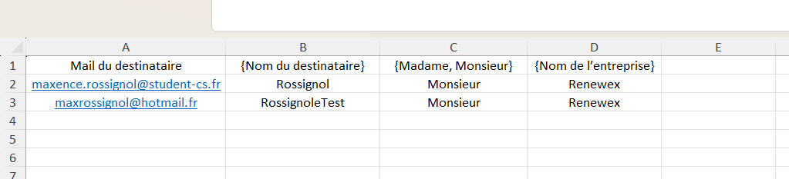
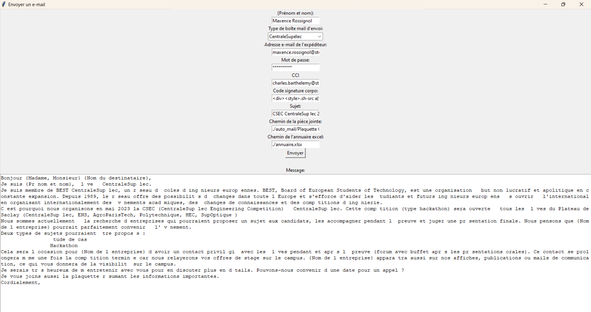

# Easy Mail - Automated Email Sender

A Python-based email automation tool that allows you to send personalized emails to multiple recipients using data from an Excel file. This project was created before the ChatGPT era, so while the functionality is solid, the UI is basic and could use modernization.

## Features

- Send personalized emails to multiple recipients using data from an Excel file
- Support for both Gmail and CentraleSupélec email accounts
- Automatic signature insertion
- PDF attachment support
- BCC (Blind Carbon Copy) functionality
- Saves configuration between sessions
- Cross-platform support (Windows and macOS)
- Unlimited variable support through Excel columns

## Prerequisites

- Python 3.x
- Required Python packages:
  - pandas
  - openpyxl

## Installation

1. Clone or download this repository
2. Install the required packages:
   ```bash
   pip install pandas openpyxl
   ```

## Usage

1. Prepare your Excel file (`annuaire.xlsx`) with recipient information:
   - First column must be email addresses
   - Any additional column becomes automatically available as a variable in your email template
   - Example columns: FirstName, LastName, Company, Department, etc.



2. Run the program:
   - On Windows: Double-click `launcher_WINDOWS.bat`
   - On macOS: Run `launcher_MAC.sh` or execute `python auto_mail/mails_auto.py` directly

3. Fill in the required information in the GUI:
   - Your name
   - Email type (CentraleSupélec or Gmail)
   - Email address and password
   - BCC recipients (comma-separated)
   - Corporate signature code
   - Email subject
   - Path to PDF attachment
   - Path to Excel file
   - Email message template



4. Click "Send" to start sending emails

## Message Template

The program features a powerful variable system that makes it extremely flexible for any use case:

- `{Prénom et nom}` - Will be replaced with your name
- Any Excel column header becomes automatically available as a variable
- Simply use the column name in curly braces in your template: `{ColumnName}`
- You can add as many variables as needed by adding more columns to your Excel file
- Example template:
  ```
  Dear {FirstName},

  Thank you for your interest in {Company}. We are pleased to confirm your registration for the {EventName} event.

  Best regards,
  {Prénom et nom}
  ```

## Configuration

The program automatically saves your configuration in `auto_mail/config.txt` and loads it the next time you start the program.

## Security Note

- Store your email credentials securely
- The program uses standard SMTP ports (587) with TLS encryption
- For Gmail, you'll need to use an App Password if you have 2FA enabled

## Limitations

- Basic GUI interface (pre-ChatGPT era design)
- Limited to PDF attachments
- Requires manual configuration of email credentials
- No email queue or retry mechanism